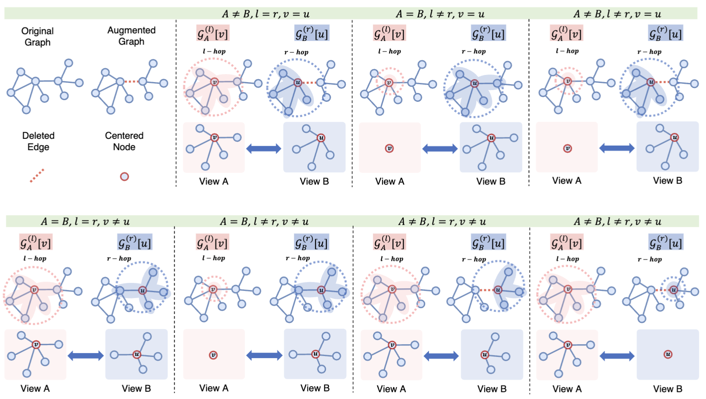

# lrGAE: graph autoencoders as contrastive learning architectures



# 🚀 Installation

Please make sure you have installed [PyTorch](https://pytorch.org) and [PyTorch Geometric (PyG)](https://pytorch-geometric.readthedocs.io/en/latest/notes/installation.html).


```bash
# Coming soon
pip install -U lrgae
```

or

```bash
# Recommended
git clone https://github.com/EdisonLeeeee/lrGAE.git && cd lrGAE
pip install -e . --verbose
```

where `-e` means "editable" mode so you don't have to reinstall every time you make changes.

# Reproduction
+ [Node classification task](./examples/node_classification)
+ [Link prediction task](./examples/link_prediction)
+ [Graph clustering task](./examples/graph_clustering)
+ [Graph classification task](./examples/graph_classification)

# 👀 Implementations
+ GAE
+ VGAE
+ MaskGAE
+ GraphMAE
+ GraphMAE2
+ AUG-MAE
+ GiGaMAE
+ S2GAE
+ 7 variants of lrGAE (our works)

