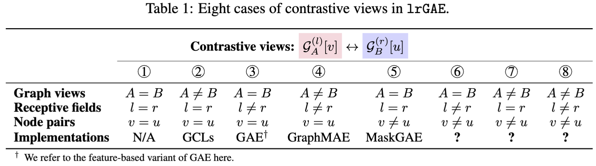

# Revisiting and Benchmarking Graph Autoencoders: A Contrastive Learning Perspective

We introduce `lrGAE` benchmark --- graph autoencoders as contrastive learning architectures.




# Environment Setup
Before you begin, please make sure that you have Anaconda or Miniconda installed on your system. This guide assumes that you have a CUDA-enabled GPU.

```shell
# Create and activate a new Conda environment named 'lrGAE'
conda create -n lrGAE
conda activate lrGAE

# Install Pytorch 2.2.0 with CUDA 12.2 support
# If your use a different CUDA version, please refer to the PyTorch website for the appropriate versions.
conda install numpy
conda install pytorch==2.2.0 pytorch-cuda=12.2 -c pytorch -c nvidia

# Install additional dependencies
pip install torch_geometric
```
Additional dependences of PyG can be found at https://pytorch-geometric.readthedocs.io/en/latest/notes/installation.html

# 🚀 Installation
Please make sure you have installed [PyTorch](https://pytorch.org) and [PyTorch Geometric (PyG)](https://pytorch-geometric.readthedocs.io/en/latest/notes/installation.html).


```bash
# Coming soon
pip install -U lrgae
```

or

```bash
# Recommended
git clone https://github.com/EdisonLeeeee/lrGAE.git && cd lrGAE
pip install -e . --verbose
```

where `-e` means "editable" mode so you don't have to reinstall every time you make changes.

# Reproduction
Five graph-based learning tasks are supported:

+ [Node classification task](./examples/node_classification)
+ [Link prediction task](./examples/link_prediction)
+ [Graph clustering task](./examples/graph_clustering)
+ [Graph classification task](./examples/graph_classification)
+ [Heterogeneous node classification task](./examples/hetero_node_classification)

# 👀 Implementations
+ GAE and GAE$_f$: Variational graph auto-encoders. NeurIPS 2016 
+ MaskGAE: What’s behind the mask: Understanding masked graph modeling for graph autoencoders. KDD 2023
+ GraphMAE: GraphMAE: Self-supervised masked graph autoencoders. KDD 2022
+ GraphMAE2: GraphMAE2: A decoding-enhanced masked self-supervised graph learner. WWW 2023
+ AUG-MAE: Rethinking graph masked autoencoders through alignment and uniformity. AAAI 2024
+ GiGaMAE: GiGaMAE: Generalizable graph masked autoencoder via collaborative latent space reconstruction. CIKM 2023
+ S2GAE: S2GAE: self-supervised graph autoencoders are generalizable learners with graph masking. WSDM 2023
+ 7 variants of lrGAE
    + lrGAE-ABllvv
    + lrGAE-AAlrvv
    + lrGAE-ABlrvv
    + lrGAE-AAllvu
    + lrGAE-AAlrvu
    + lrGAE-ABllvu
    + lrGAE-ABlrvu
