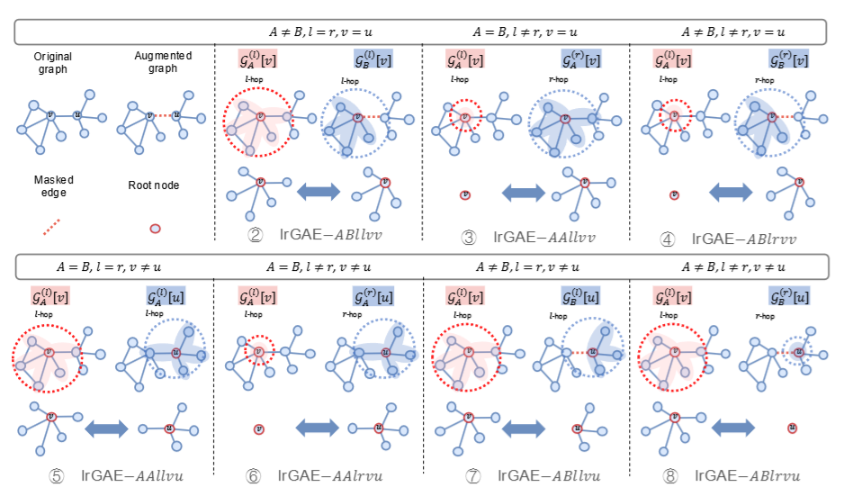

# Revisiting and Benchmarking Graph Autoencoders: A Contrastive Learning Perspective

<p align="center">  <p align="center"><em>Fig. 1. Comparison of different GAEs from contrastive learning perspective.</em></p>

We introduce the `lrGAE` (left-rigt GAE) benchmark --- graph autoencoders as contrastive learning architectures. lrGAE provides a new contrastive learning perspective of designing powerful GAEs from five dimensions:
+ Augmentations
+ Encoder/decoder networks
+ Contrastive views
+ Contrastive losses
+ (optional) Negative examples

The **contrastive views** is the key to design different yet advanced GAEs, which invovels three components: *graph views, receptive fields, and node pairs.*

+ Graph views: the graph or augmentated graph in two contrastive views, denoted as graph $A$ or $B$.
+ Receptive fields: the depth of the graph neural network or the number of sampled hops in a node's neighborhood, denoted as $l$ or $r$.
+ Node pairs: the contrasting objective over a single node $v$ or two nodes $v$ and $u$.

Therefore, we have $2^3=8$ variants of lrGAE in terms of the **contrastive views**, shown below:

<p align="center">  <p align="center"><em>Table 1. Illustration of all possible cases of GAEs falling within the lrGAE frmework</em></p>

> [!NOTE]
> Actually, we got 7 variants since lrGAE-1 is not applicable as a contrastive method. 
> There are more than 7 variants of lrGAE, you can design more powerful GAEs by exploring different combinations of augmentation strategies, encoder/decoder networks, contrastive views, contrastive losses and even the negative sampling tricks.

# 💫 Environment Setup

Before you begin, please make sure that you have Anaconda or Miniconda installed on your system. This guide assumes that you have a CUDA-enabled GPU.

```shell
# Create and activate a new Conda environment named 'lrGAE'
conda create -n lrGAE python==3.12 -c conda-forge -y
conda activate lrGAE

# Install Pytorch 2.3.1 with CUDA 12.1 support
# If your use a different CUDA version, please refer to the PyTorch website for the appropriate versions.
pip install torch==2.3.1 torchvision==0.18.1 torchaudio==2.3.1 --index-url https://download.pytorch.org/whl/cu121

# Install PyG
pip install torch_geometric
# Install additional dependencies of PyG
pip install pyg_lib torch_scatter torch_sparse torch_cluster -f https://data.pyg.org/whl/torch-2.3.0+cu121.html
```
Additional dependences of PyG can be found at https://pytorch-geometric.readthedocs.io/en/latest/notes/installation.html

# 🚀 Installation
Please make sure you have installed [PyTorch](https://pytorch.org) and [PyTorch Geometric (PyG)](https://pytorch-geometric.readthedocs.io/en/latest/notes/installation.html).


```bash
# Coming soon
pip install -U lrgae
```

or

```bash
# Recommended
git clone https://github.com/EdisonLeeeee/lrGAE.git && cd lrGAE
pip install -e . --verbose
```

where `-e` means "editable" mode so you don't have to reinstall every time you make changes.

# 📍 Reproduction
Five graph-based learning tasks are supported:

+ [Node classification task](./examples/node_classification)
+ [Link prediction task](./examples/link_prediction)
+ [Graph clustering task](./examples/graph_clustering)
+ [Graph classification task](./examples/graph_classification)
+ [Heterogeneous node classification task](./examples/hetero_node_classification)

# 👀 Implementations


+ GAE: [Variational graph auto-encoders](https://arxiv.org/abs/1611.07308). NeurIPS 2016 
+ MaskGAE: [What’s behind the mask: Understanding masked graph modeling for graph autoencoders](https://arxiv.org/abs/2205.10053). KDD 2023
+ GraphMAE: [GraphMAE: Self-supervised masked graph autoencoders](https://arxiv.org/abs/2205.10803). KDD 2022
+ GraphMAE2: [GraphMAE2: A decoding-enhanced masked self-supervised graph learner](https://arxiv.org/abs/2304.04779). WWW 2023
+ AUG-MAE: [Rethinking graph masked autoencoders through alignment and uniformity](https://arxiv.org/abs/2402.07225). AAAI 2024
+ GiGaMAE: [GiGaMAE: Generalizable graph masked autoencoder via collaborative latent space reconstruction](https://arxiv.org/abs/2308.09663). CIKM 2023
+ S2GAE: [S2GAE: self-supervised graph autoencoders are generalizable learners with graph masking](https://dl.acm.org/doi/10.1145/3539597.3570404). WSDM 2023
+ 7 variants of lrGAE in terms of different contrastive views (See Fig.2 for illustration)
    + 2️⃣ lrGAE-ABllvv
    + 3️⃣ lrGAE-AAlrvv
    + 4️⃣ lrGAE-ABlrvv
    + 5️⃣ lrGAE-AAllvu
    + 5️⃣ lrGAE-AAlrvu
    + 7️⃣ lrGAE-ABllvu
    + 8️⃣ lrGAE-ABlrvu
 
<p align="center">  <p align="center"><em>Fig. 2. Illustration of seven possible cases of lrGAE.</em></p>
